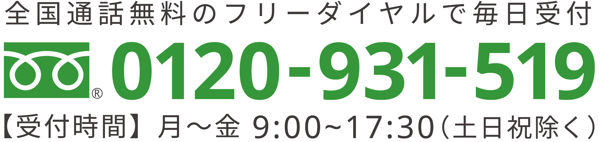
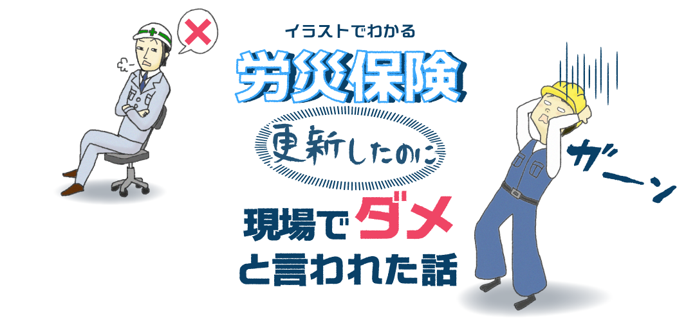
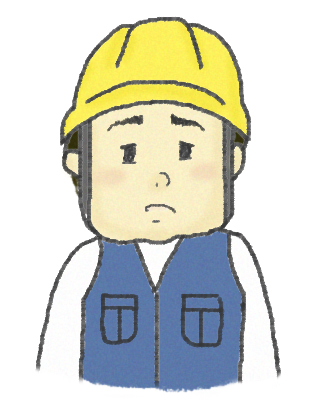
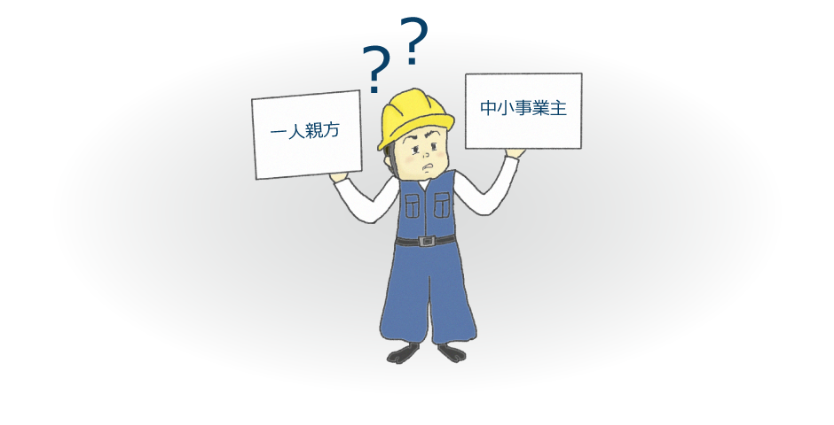

[index.html](https://github.com/user-attachments/files/26698151/index.html)
<!DOCTYPE html>
<html lang="ja">
<head>
  <meta charset="UTF-8">
  <meta name="viewport" content="width=device-width, initial-scale=1.0">
  <title>労災保険 現場でダメと言われた話！ | 中小事業主の特別加入RJC</title>
  <link rel="stylesheet" href="style.css">
</head>
<body>

  <!-- ヘッダー -->
  <header class="site-header">
    

      

        
      

      

        
      

      

  <a href="#" class="btn login-btn">
    
    マイページログイン
  </a>

  <a href="#" class="btn menu-btn">
    
    メニュー
  </a>

    

  </header>

  <!-- メインビジュアル -->
  <section class="mainvisual">
    

      
    

  </section>

<!-- CTAボタン -->

  

<!-- プロフィールエリア -->

  <!-- 人物 -->
  

    
  

  <!-- プロフィールボックス -->
  

    <h3>ろうさい太郎さんのプロフィール</h3>

    
年齢：40

    
家族構成：妻・息子（高3）・娘（高1）

    
仕事：足場工事業

    
独立して10年 従業員は2人

  

  

<section class="problem-section">

  

    <!-- タイトル -->
    <h2 class="problem-title">
      一人親方の労災保険ではダメだと言われた！
    </h2>

    <!-- 本文 -->
    

      

        ろうさい太郎さんが今入っている建設業の労災保険は、一人親方の労災保険です。
        従業員を雇っているけれど同じ労災保険なんだから今のままでいいと思い、年度更新もしました。
      

      

        ところが、ある現場で突然「一人親方の労災保険ではダメだ」と現場監督に言われてしまい、
        なんとその仕事を請けることができませんでした。
        実は、ろうさい太郎さんは従業員を雇っているので、
        一人親方の労災保険はいざという時に使えないのです。
        せっかく加入しているのに、労災保険が使えないばかりでなく、
        それを理由に現場監督に仕事を断られてしまいました。
      

    

  

</section>
  
<!-- 監修セクション -->
<section class="supervisor-section">
  

    <h2 class="supervisor-title">【本記事の監修】</h2>

    

      <!-- 左：人物画像 -->
      

        
      

      <!-- 中央：プロフィール -->
      

        
はやし　みつる

        <h3 class="name-main">林　満</h3>

        
元厚生労働省　厚生労働事務官

        
厚生労働大臣認可　愛知労働局長認可　建設業専門

        
労働保険事務組合RJC　アドバイザー

      

      <!-- 右：コメント -->
      

        

          現場で突然こう言われたら困ってしまいますね。 
          こんなときどうすればいいか、元厚生労働事務官の林がお答えします。
        

      

    

  

</section>

<section class="flow-section">

  

    <!-- タイトル -->
    

      
    

    <!-- 人物 -->
    

      
    

    <!-- ボタン -->
    

      
    

  

</section>

</body>
</html>
